***28/12/2021 12:36***

## What is machine learning?

There's a science of getting computers to learn without being explicitly programmed.

**Quiz**

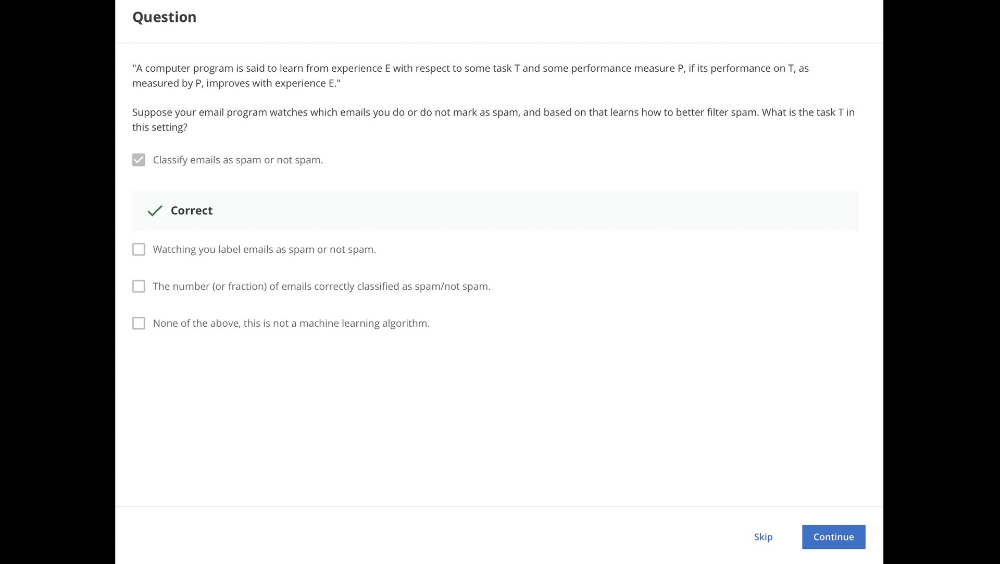

## Types of machine learning

- Supervised Learning
    
    1.  **Regression** \- The goal is to predict a **continuous** value output.
    2.  **Classification** \- The goal is to predict a **discrete** value output.
- Unsupervised Learning
    
- Reinforcement Learning
    

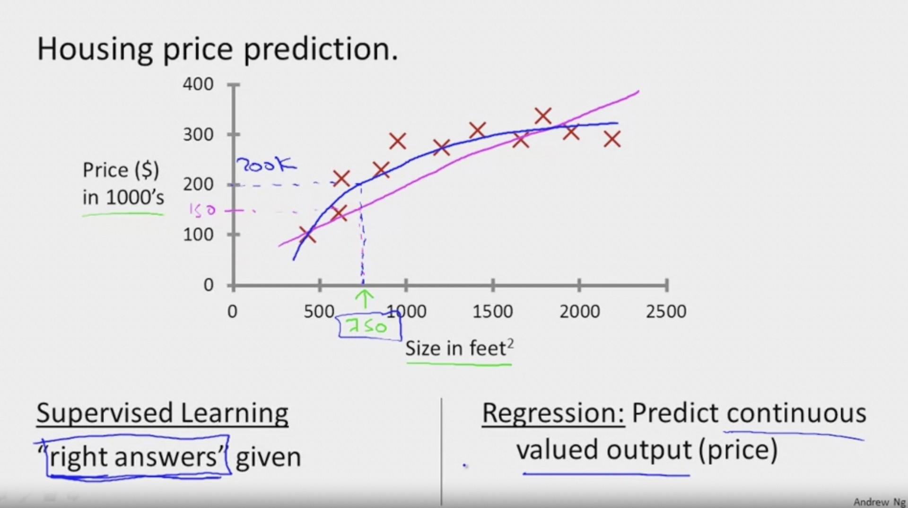

* * *

## Sublimentry References:

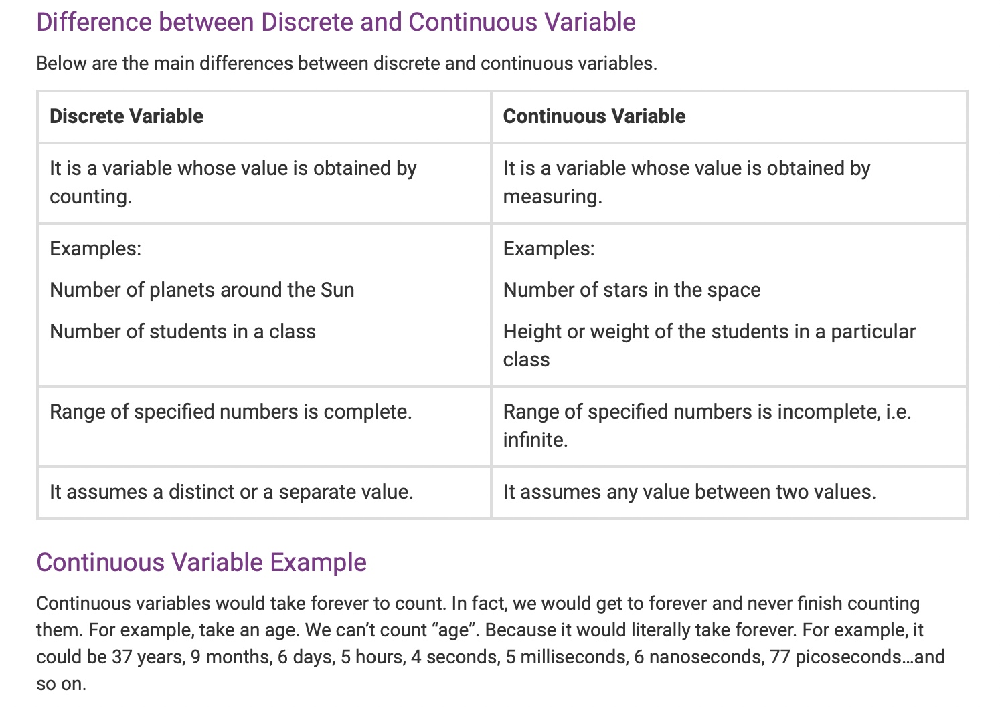

> ### Real number
> 
> [https://mathigon.org/world/Real\_Irrational\_Imaginary](https://mathigon.org/world/Real_Irrational_Imaginary)
> 
> ### Support Vector Machines
> 
> It allow a computer to deal with an ==infinite number of features.==

**Quiz**

**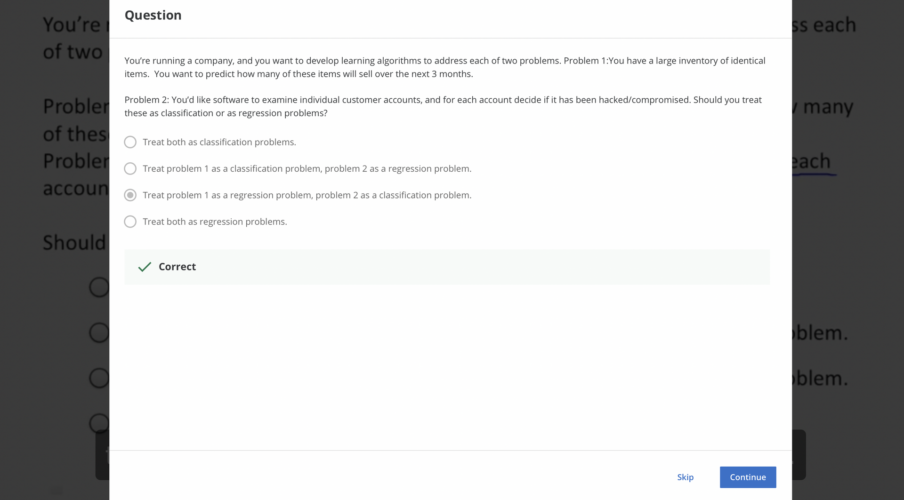**

**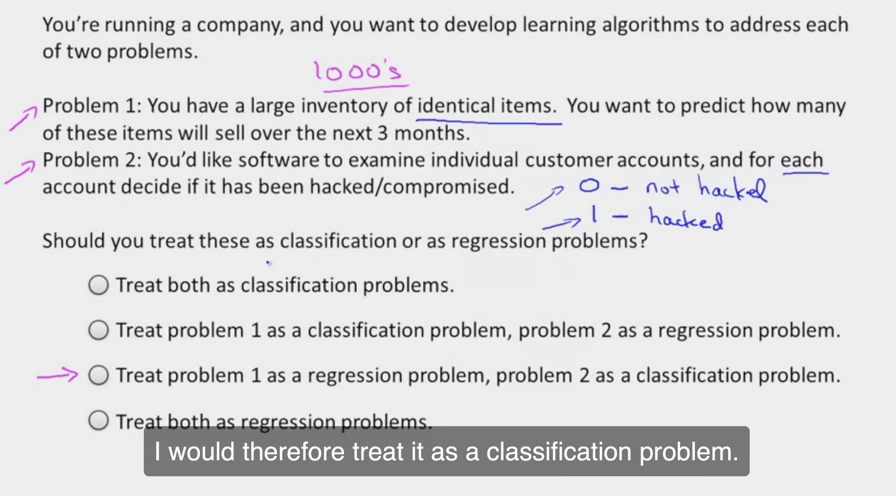**

* * *

## Supervised Learning

In supervised learning, ==we are given a data set and already know what our correct output should look like, having the idea that there is a relationship between the input and the output.==

Supervised learning problems are categorized into "regression" and "classification" problems. In a regression problem, we are trying to predict results within a continuous output, meaning that we are trying to map input variables to some continuous function. In a classification problem, we are instead trying to predict results in a discrete output. In other words, we are trying to map input variables into discrete categories.

**Example 1:**

Given data about the size of houses on the real estate market, ==try to predict their price. Price as a function of size is a continuous output, so this is a regression problem==.

We could turn this example into a classification problem by ==instead making our output about whether the house "sells for more or less than the asking price.==" Here we are classifying the houses based on price into two discrete categories.

**Example 2**:

(a) Regression - Given a picture of a person, we have to predict their age on the basis of the given picture

(b) Classification - Given a patient with a tumor, we have to predict whether the tumor is malignant or benign.

> **==Supervised learning==**
> 
> ==We already given a price based on size of the houses from a given dataset. So, that it will be easy to predict the future of the given house.==

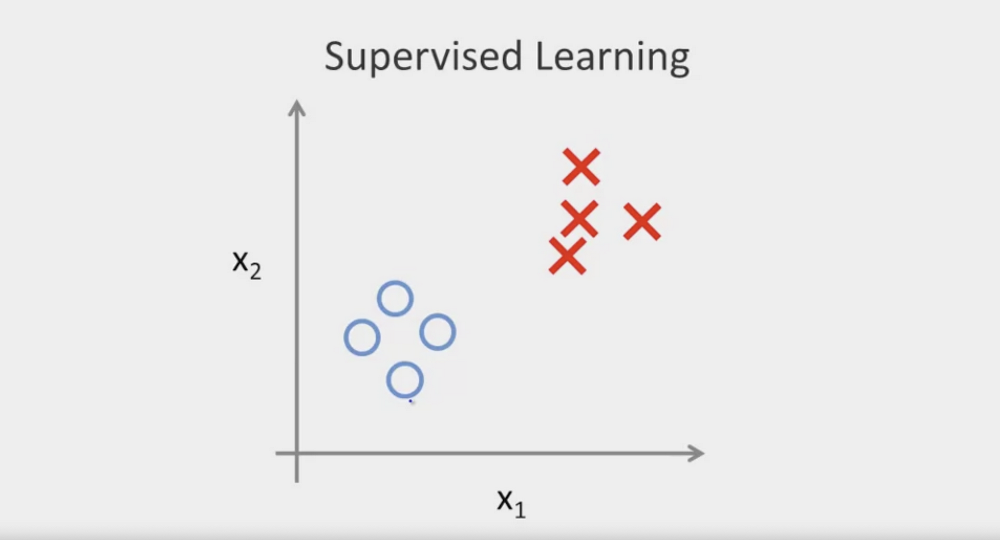

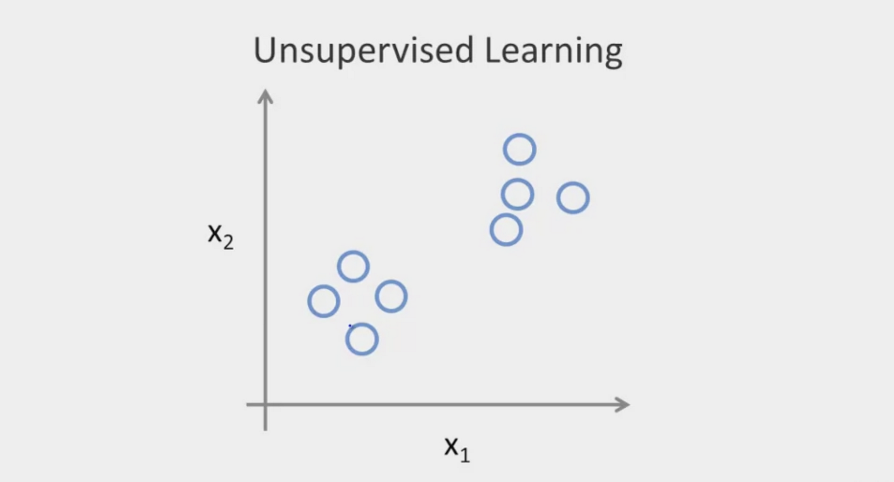

**Quiz**

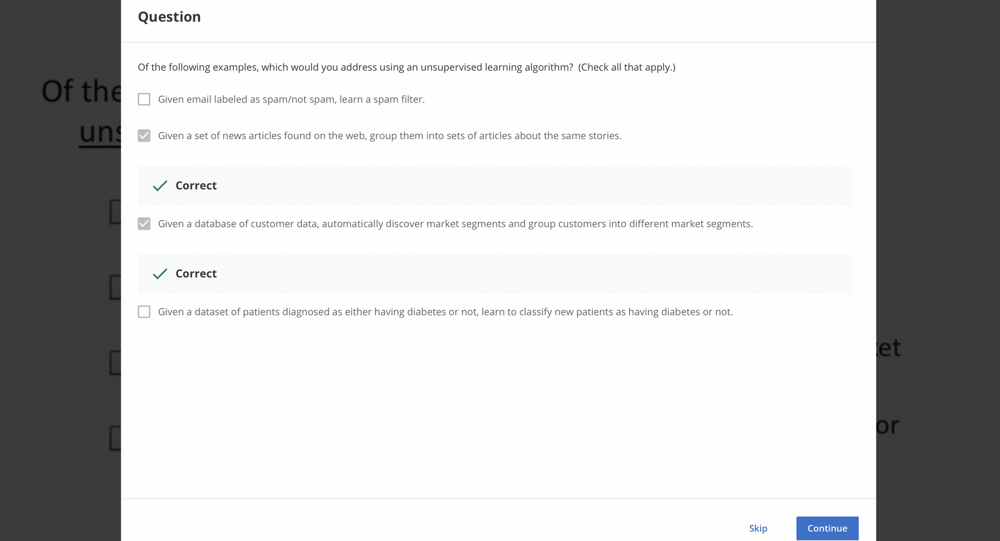

* * *

## Unsupervised Learning

Unsupervised learning allows us to approach problems with little or no idea what our results should look like. We can derive structure from data where we don't necessarily know the effect of the variables.

==We can derive this structure by clustering the data based on relationships among the variables in the data==.

With unsupervised learning there is no feedback based on the prediction results.

**Example:**

==Clustering: Take a collection of 1,000,000 different genes, and find a way to automatically group these genes into groups that are somehow similar or related by different variables, such as lifespan, location, roles, and so on.==

Non-clustering: The "Cocktail Party Algorithm", allows you to find structure in a chaotic environment. (i.e. identifying individual voices and music from a mesh of sounds at a <ins>cocktail party</ins>).

**Take a Quiz(Must)**

[https://www.coursera.org/learn/machine-learning/exam/wjqip/introduction](https://www.coursera.org/learn/machine-learning/exam/wjqip/introduction "Take a Quiz")

* * *

## Model Representation

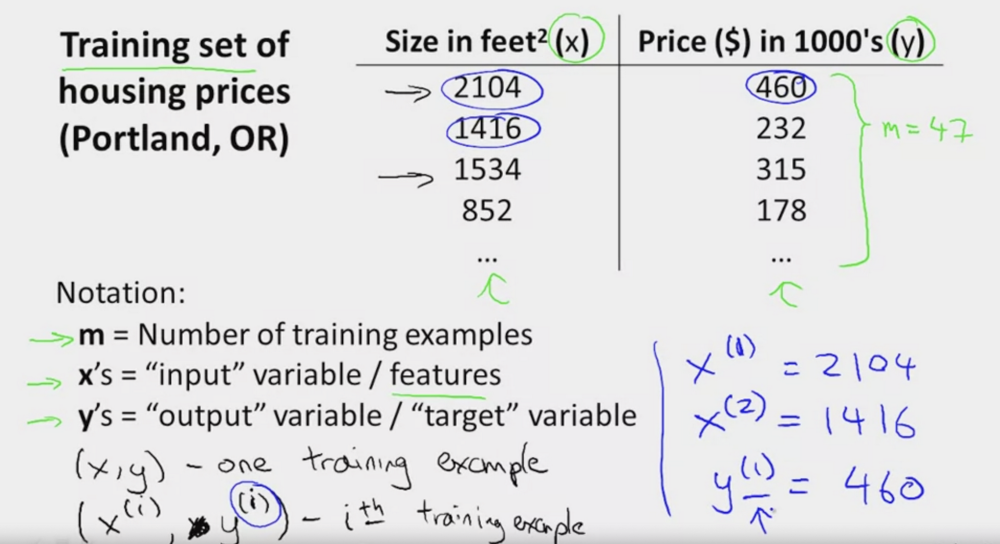

**Quiz**

**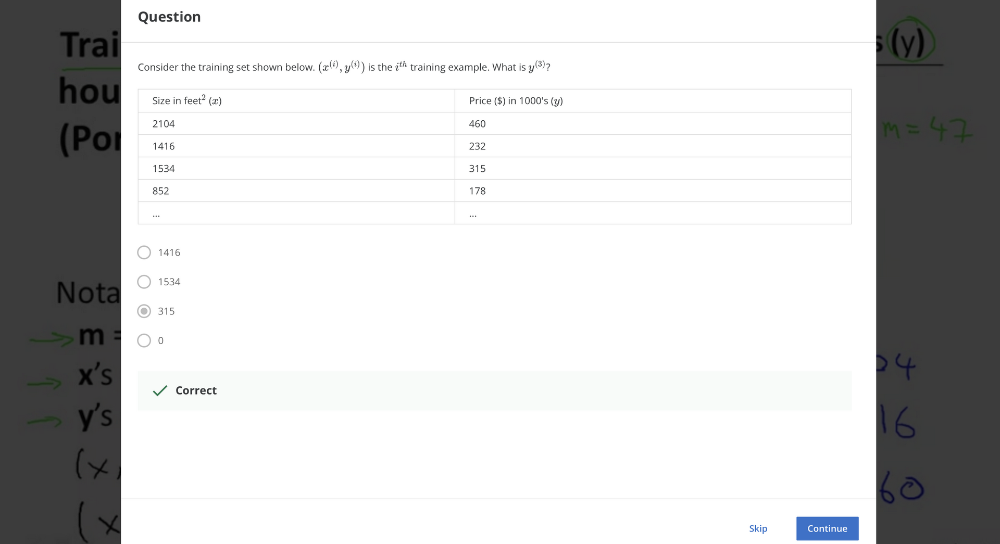**

**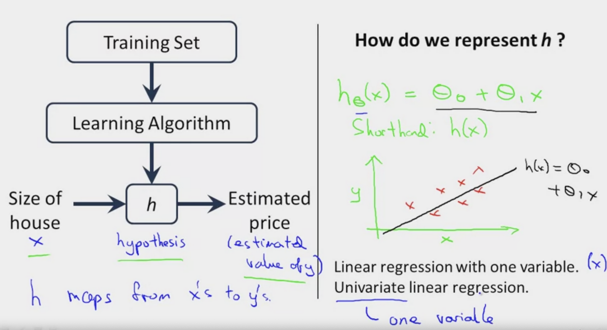**

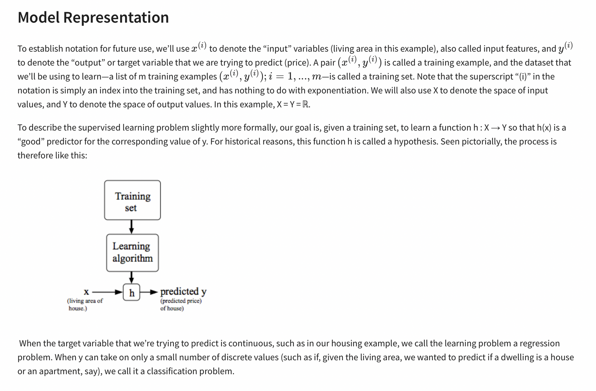